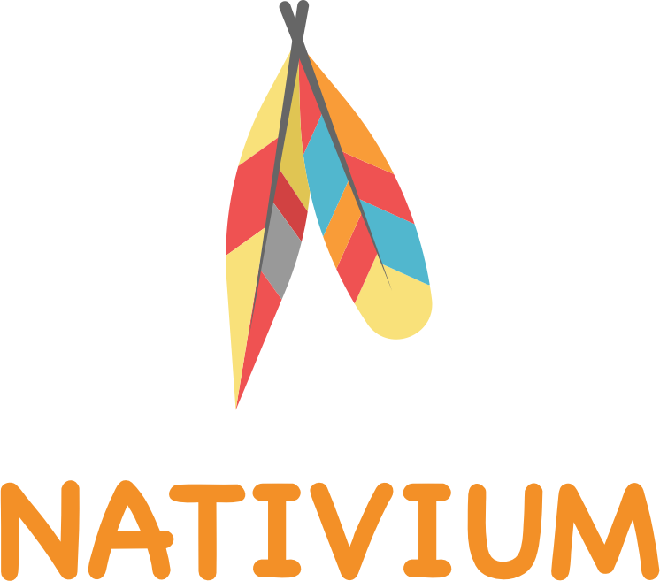
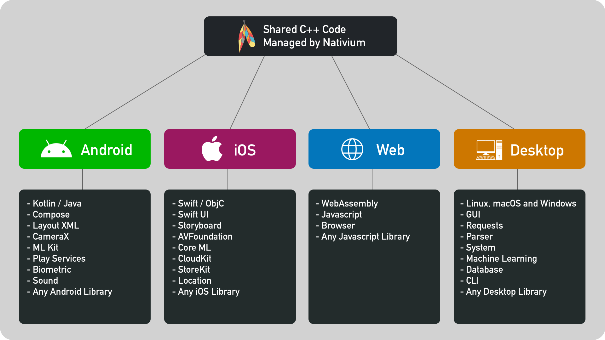

    
     
     
    C++ Multiplatform Modular Toolkit Template
     
    Nativium Philosophy: Write Once And Compile Anywhere
     

 

    
    
    
    
    
    
    

    

## About

Write a **single code** in C++ and compile for **any platform**.

Supported platforms:

- Linux
- macOS
- Windows
- Android
- iOS
- tvOS
- watchOS
- macCatalyst
- Web Assembly (WASM)

This **template** project generates **libraries** and **executables** that share the same C++ code between them.

The generated binary can be used in a **new project** or an **existing project**.

You can also write **platform-specific** code that talks to C++ code, and you can write C++ code that talks directly to **platform code**. An example would be a C++ code that talks to the **mobile platform** (Java and Objective-C) to know the battery level, or a code used on the mobile platform that uses C++ libraries to access the database and make HTTP requests.

    

## How it work?

Nativium have two main concepts:

- **modules:** what code and dependencies need be compiled
- **targets:** how the code will be compiled (each platform is a target)

## What tools was used?

- **python:** to write all scripts (everything work from command line)
- **cmake:** to organize source code and projects to be compiled
- **conan:** to compile all C++ dependencies
- **djinni:** to generate glue code between C++ and mobile

## Template

This is a **template repository** that let you **start** easy and **now** your own project.

Think about the **code** instead of C++ project **structure** and organization, it is already done with Nativium.

Download this template and check **sample apps** to test and see it working on mobile, desktop and web.

Every **command** to setup, build, package, generate and distribute, can be executed from **command line** and you can use any editor to work with Nativium.

Each piece of code is separated by **modules**, making easy **extend** with custom code or any other C++ code and library.

## Documentation

Read all about Nativium in the auto-generated documentation:

[https://nativium.s3.amazonaws.com/docs/index.html](https://nativium.s3.amazonaws.com/docs/index.html)

## Demo

See Web Assembly (WASM) demo here :

[https://nativium.s3.amazonaws.com/demo/1.0.0/index.html](https://nativium.s3.amazonaws.com/demo/1.0.0/index.html)

## Other projects

These projects were made using the Nativium architecture with a feature called `custom install`, showing the power of the Nativium project in different types of projects.

- [Modules](https://github.com/nativium/nativium-modules): Lof of modules already implemented for Nativium.
- [HTTP Server](https://github.com/nativium/nativium-http-server): HTTP server sample to create your backend, api or microservices (linux, macos and windows)
- [Game](https://github.com/nativium/nativium-game): Game sample that run on all platforms (linux, macos, windows, ios, android and wasm)

## Buy me a coffee

## License

[MIT](http://opensource.org/licenses/MIT)

Copyright (c) 2021-2026, Paulo Coutinho
