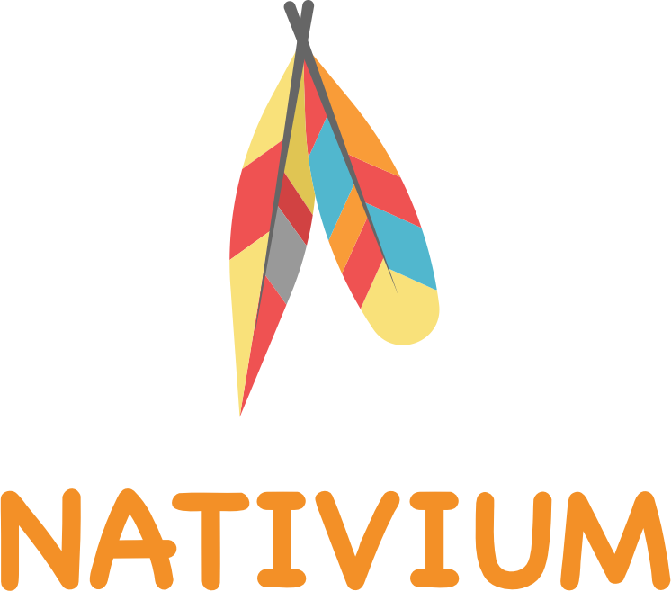
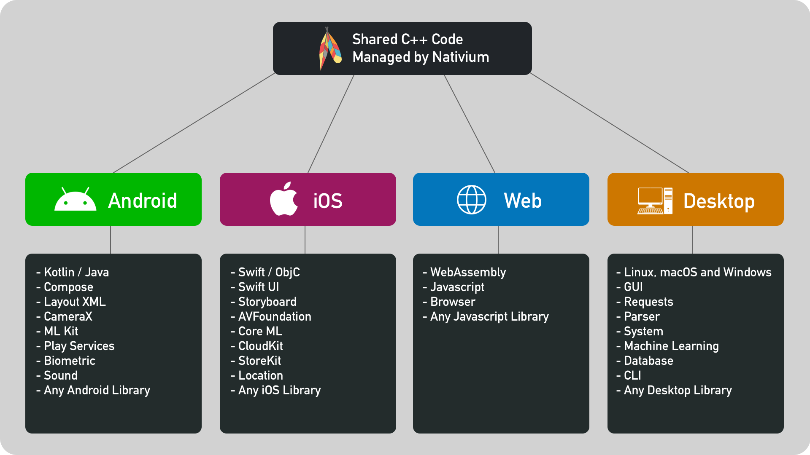

# Home

    
     
     
    C++ Multiplatform Modular Toolkit Template
     
    Nativium Philosophy: Write Once And Compile Anywhere
     

 

    

 

## Source code

You can download Nativium source here:

[https://github.com/nativium/nativium](https://github.com/nativium/nativium)

## Demo

You can see web assembly (WASM) demo here :

[https://nativium.s3.amazonaws.com/demo/1.0.0/index.html](https://nativium.s3.amazonaws.com/demo/1.0.0/index.html)

## Other projects

These projects were made using the Nativium architecture with a feature called `custom install`, showing the power of the Nativium project in different types of projects.

- [Modules](https://github.com/nativium/nativium-modules): Lof of modules already implemented for Nativium.
- [HTTP Server](https://github.com/nativium/nativium-http-server): HTTP server sample to create your backend, api or microservices (linux, macos and windows)
- [Game](https://github.com/nativium/nativium-game): Game sample that run on all platforms (linux, macos, windows, ios, android and wasm)

## Versions

* Linux: {{ linux_version }}
* macOS: {{ macos_version }}
* Windows: {{ windows_version }}
* iOS: {{ ios_version }}
* tvOS: {{ tvos_version }}
* watchOS: {{ watchos_version }}
* macCatalyst: {{ maccatalyst_version }}
* Android: {{ android_version }}
* Web Assembly (WASM): {{ wasm_version }}
